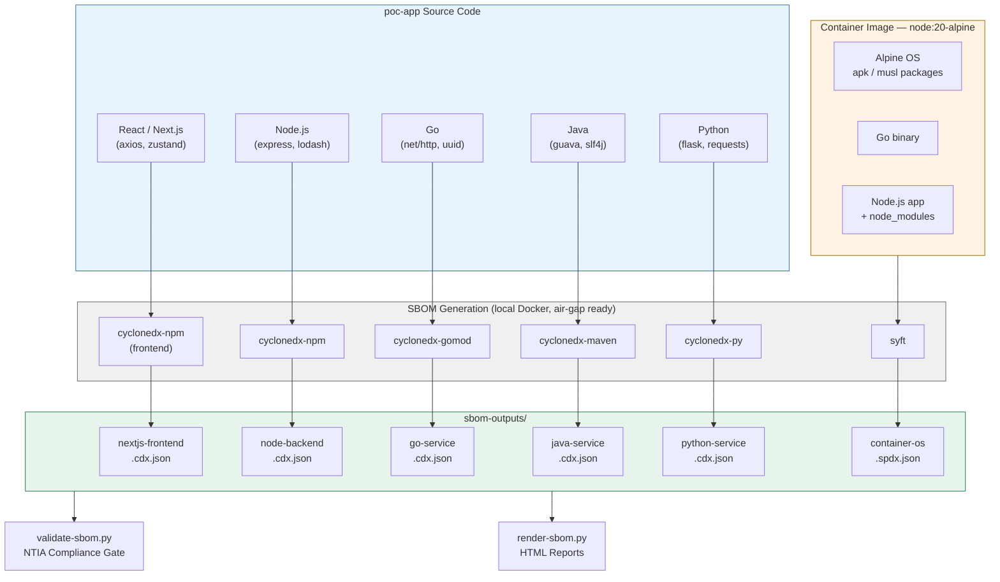

# Multi-Layer SBOM Generation PoC

> **[Interactive SBOM Reports (GitHub Pages)](https://leoluyi.github.io/sbom-demo/sbom-reports/)**

A self-contained, on-premises proof of concept for **automated, multi-layer
Software Bill of Materials (SBOM) generation**. Each application language is
inventoried with its **official CycloneDX language-specific generator**, and the
container's operating-system layer is inventoried with **syft** — all locally,
with no SBOM data sent to any external API.

| Layer | Tool | Format |
|-------|------|--------|
| React / Next.js (app) | `@cyclonedx/cyclonedx-npm` | CycloneDX JSON |
| Node.js (app) | `@cyclonedx/cyclonedx-npm` | CycloneDX JSON |
| Go (app) | `cyclonedx-gomod` | CycloneDX JSON |
| Java (app) | `cyclonedx-maven-plugin` | CycloneDX JSON |
| Python (app) | `cyclonedx-py` | CycloneDX JSON |
| OS / container | `syft` | SPDX JSON |

## Architecture



## Objectives

The PoC set out to demonstrate, entirely on a local machine, that a
multi-language project can be inventoried across both the application and
operating-system layers and validated for regulatory compliance.

| # | Objective | Outcome | Evidence |
|---|------|---------|----------|
| 1 | **Multi-language mock project** — React/Next.js, Node.js, Go, Java, Python + a multi-stage container image | Met | [docs/architecture.md](docs/architecture.md) |
| 2 | **On-prem, multi-layer SBOM generation** — per-language CycloneDX (app) + syft SPDX (OS), no external API | Met | 6 artifacts, see [Results](#results) |
| 3 | **Compliance validation & extraction** — verify Author / Name / Version / License; count deps per layer | Met | all PASS, see [Results](#results) |
| 4 | **Air-gapped SBOM generation & license extraction** — all license data derived from local package metadata (package.json / POM / METADATA / image filesystem), no external license API required; packages obtained via local registry mirrors | Met | App layer 100% coverage; OS layer 293/297 `licenseDeclared` (4 missing are app binaries, not third-party deps) |

## Quickstart

Requires **Docker**, **jq**, and **uv** on the host (no language toolchains
needed — generators run in containers). See
[docs/prerequisites.md](docs/prerequisites.md).

```bash
./generate-sbom.sh        # generate all SBOMs + render HTML reports into ./sbom-outputs/
uv run validate-sbom.py   # validate compliance fields, exits 0/1
uv run render-sbom.py     # (re)render HTML reports into ./sbom-outputs/html/
```

`generate-sbom.sh` renders per-artifact HTML reports (plus an `index.html`) into
`./sbom-outputs/html/` as its final step — CycloneDX inventory/licenses via
`sbom-utility`, the SPDX OS layer via `spdx-tools`. See
[docs/rendering-html.md](docs/rendering-html.md).

## Results

Output of a full reference run, validated by `validate-sbom.py`. Mandatory
compliance fields checked: **Author, Component Name, Version, License**.

| Artifact | Layer | Generator | Components | License coverage | Status |
|----------|-------|-----------|-----------:|-----------------:|:------:|
| `nextjs-frontend.cdx.json` | React / Next.js app | cyclonedx-npm | 50 | 100% | PASS |
| `node-backend.cdx.json`   | Node.js app | cyclonedx-npm   | 68  | 100% | PASS |
| `go-service.cdx.json`     | Go app      | cyclonedx-gomod | 1   | 100% | PASS |
| `java-service.cdx.json`   | Java app    | cyclonedx-maven | 8   | 100% | PASS |
| `python-service.cdx.json` | Python app  | cyclonedx-py    | 12  | 100% | PASS |
| `container-os.spdx.json`  | OS / image  | syft            | 297 | 99%  | PASS |

| Dependency totals by layer | Count |
|----------------------------|------:|
| Application components (CycloneDX) | 139 |
| OS / container packages (SPDX)     | 297 |
| **Combined**                       | **436** |

## Key conclusions

- **Multi-layer separation works as intended.** Application dependencies (139,
  via CycloneDX generators) and OS packages (297, via syft on the image) are
  inventoried independently and are clearly distinguishable.
- **Native CycloneDX generators give complete, license-rich application SBOMs**
  — 100% Author/Name/Version/License coverage on all five language layers,
  resolved locally without any external SBOM API.
- **Fully on-premises and reproducible.** Every generator runs as a pinned
  Docker container; the only network access is to package registries, which an
  air-gapped mirror can serve.
- **CI-ready compliance gate.** `validate-sbom.py` exits non-zero on any missing
  mandatory field, so it can fail a pipeline directly.
- **Two coverage caveats worth noting.** syft reports ~99% OS license coverage
  (4 base-image packages lack declared licenses), and detected-but-not-declared
  licenses are accepted from `component.evidence.licenses` as well as the
  asserted field. See [docs/implementation-notes.md](docs/implementation-notes.md).

## Documentation

| Document | Contents |
|----------|----------|
| [docs/sbom-principles.md](docs/sbom-principles.md) | SBOM 產生原理、兩層掃描架構、Repo 掃描要件 |
| [docs/prerequisites.md](docs/prerequisites.md) | Host requirements and pinned tool versions |
| [docs/architecture.md](docs/architecture.md) | Multi-layer approach, project layout, container image |
| [docs/generating-sboms.md](docs/generating-sboms.md) | Running `generate-sbom.sh`, outputs, configuration |
| [docs/validating-sboms.md](docs/validating-sboms.md) | Running `validate-sbom.py`, reading the report, severity model |
| [docs/rendering-html.md](docs/rendering-html.md) | Rendering HTML reports with `render-sbom.py` (sbom-utility + spdx-tools) |
| [docs/implementation-notes.md](docs/implementation-notes.md) | Author stamping, Go license assertion, Python `uv`/PEP 639 |
