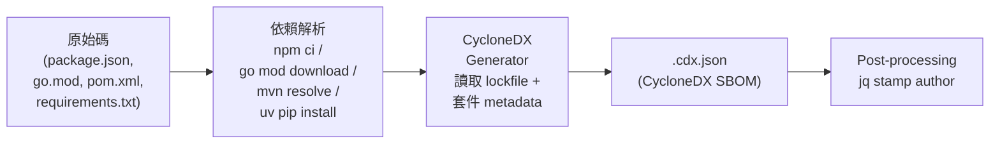
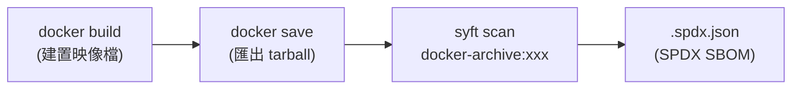

# SBOM 產生原理與掃描要件

## SBOM 是什麼、為什麼需要它

SBOM（Software Bill of Materials，軟體物料清單）是一份結構化的清單，記錄
軟體產品中使用的所有第三方元件及其版本、授權條款等 metadata。它的角色類似
製造業的 BOM（物料清單）——讓你知道產品裡用了什麼料。

企業需要 SBOM 的主要理由：

- **合規要求**：NTIA Minimum Elements、EU CRA 等法規要求軟體供應商提供 SBOM
- **資安管理**：當某個套件爆出漏洞（如 Log4Shell），SBOM 讓你在幾分鐘內確認
  哪些產品受影響，而不是花數天人工排查
- **授權合規**：確認所有使用的開源元件的授權條款與企業政策相容

## 兩層掃描架構

本專案將 SBOM 拆成兩層獨立產生，因為它們的資料來源和適用工具完全不同：

| 層 | 掃描對象 | 工具類型 | 輸出格式 | 資料來源 |
|---|---------|---------|---------|---------|
| **Application** | 各語言的第三方套件依賴 | CycloneDX 官方語言產生器 | CycloneDX JSON | 套件管理器的 lockfile + 已安裝套件的 metadata |
| **OS / Container** | 容器映像檔中的 OS 套件 | syft | SPDX JSON | Image filesystem 中的套件資料庫 (apk, dpkg, rpm…) |

為什麼要分開：

- **工具專長不同**：CycloneDX 語言產生器理解該語言生態系的 lockfile 格式和
  metadata 結構；syft 理解 OS 套件管理器的資料庫格式。混用會漏掃或資訊不全。
- **粒度不同**：Application 層掃的是 npm package、Go module、Maven artifact、
  Python distribution；OS 層掃的是 apk/deb/rpm package。兩者不重疊。
- **責任歸屬不同**：Application 依賴由開發團隊選擇和管理；OS 套件由 base image
  維護者決定。分開盤點讓責任邊界清楚。

## Application Layer 的產生流程

每個語言的 CycloneDX 產生器運作原理相同，差異只在讀取的 lockfile 格式和
metadata 位置。通用流程：

### 四個步驟

1. **Staging**：將 source 複製到暫存目錄，避免依賴解析污染 working tree
2. **Dependency resolution**：在 Docker 容器內執行套件管理器（`npm ci` / `go mod
   download` / `mvn` / `uv pip install`），把完整依賴樹解析並安裝到本地
3. **SBOM generation**：執行該語言的 CycloneDX generator，它讀取 lockfile 和已
   安裝套件的 metadata，萃取每個元件的 name、version、license、purl，產出
   CycloneDX JSON
4. **Post-processing**：用 `jq` 補上 `metadata.authors` 和 `metadata.supplier`
   （generator 預設不產生這些欄位，但它們是合規必要欄位）

### License 資訊的來源

License 完全來自本地套件 metadata，不需要呼叫任何外部 API：

| 語言 | License 資料位置 | 說明 |
|------|-----------------|------|
| Node.js / React / Next.js | 各套件 `package.json` 的 `license` 欄位 | npm registry 要求填寫，涵蓋率通常很高 |
| Go | 原始碼中的 `LICENSE` 檔案 | `cyclonedx-gomod` 做啟發式檔案偵測，`-assert-licenses` 將偵測結果提升為正式宣告 |
| Java (Maven) | 各套件 `pom.xml` 的 `<licenses>` 區塊 | Maven Central 要求發佈時填寫 |
| Python | `METADATA` 檔案的 `License-Expression` (PEP 639) 或 `License` 欄位 | 需要 `cyclonedx-bom >= 7.x` 才能讀 PEP 639 格式 |

## OS / Container Layer 的產生流程

OS 層的掃描路徑完全不同——不讀 source code，而是直接分析容器映像檔：

syft 解析映像檔每一層的 filesystem，辨識 OS 套件管理器安裝的所有套件
（apk、dpkg、rpm 等），從套件資料庫中讀取 name、version、license 等資訊。

與 Application 層的關鍵差異：

| | Application Layer | OS / Container Layer |
|---|---|---|
| 輸入 | Source code + lockfile | Container image |
| 掃描對象 | 語言套件 (npm, Go module, Maven, pip) | OS 套件 (apk, deb, rpm) |
| 工具 | 各語言 CycloneDX generator | syft |
| 輸出格式 | CycloneDX JSON | SPDX JSON |
| 需要 source code | 是 | 否 |

## Repo 必須具備的條件

### 各語言必要檔案

| 語言 | 必要檔案 | 用途 | 缺少時的後果 |
|------|---------|------|------------|
| **Node.js / React / Next.js** | `package.json` + `package-lock.json` | lockfile 提供完整依賴樹和精確版本 | generator 直接失敗；只有 `package.json` 無法確定 transitive dependency 的精確版本 |
| **Go** | `go.mod` + `go.sum` | module 依賴圖 + checksum 驗證 | 無法解析依賴 |
| **Java (Maven)** | `pom.xml`（含 `<dependencies>`） | Maven plugin 在 resolve 後從 local repo 讀取 metadata | 無法觸發 Maven lifecycle |
| **Python** | `requirements.txt` 或 `pyproject.toml` | `cyclonedx-py` 掃描已安裝的 venv | 無法建立 venv |
| **OS 層** | 可建置的 `Dockerfile` 或已存在的 container image | syft 需要 image 來掃描 | 無法產生 OS 層 SBOM |

### 共通要件

**Lockfile 是最關鍵的要件。** CycloneDX generator 本質上就是「讀 lockfile +
已安裝套件的 metadata」。沒有 lockfile：

- 無法確定 transitive dependency（間接依賴）的精確版本
- 每次產生的 SBOM 可能不同（不可重現）
- 某些 generator 會直接拒絕執行

**套件本身需要帶有 license metadata。** 如果某個套件的 `package.json` 沒有
`license` 欄位，或 Python 套件的 `METADATA` 沒有 `License-Expression`，SBOM
產得出來但該元件的 license 會是空的，導致 license coverage < 100%。

常見造成問題的狀況：

| 狀況 | 影響 | 處置 |
|------|------|------|
| 沒有 lockfile（只有 `package.json` 或未 pin 版本的 `requirements.txt`） | 依賴版本不確定，SBOM 不可重現；npm generator 直接失敗 | 執行 `npm install` / `pip freeze` 產生 lockfile 後再掃描 |
| 套件 `license` 欄位為空（常見於企業內部套件） | 該元件 license 顯示為空，coverage 下降 | 要求套件維護者補上 license 欄位 |
| Python 套件用舊版 metadata 格式 | `cyclonedx-bom < 7.x` 讀不到 PEP 639 | 使用 `cyclonedx-bom >= 7.x` |
| Go module 沒有 LICENSE 檔案 | `cyclonedx-gomod` 偵測不到 license | 確認上游 repo 有 LICENSE 檔案；使用 `-assert-licenses` |
| `metadata.authors` 缺失 | 合規驗證硬性失敗 | 用 post-processing（如 `jq`）補上，見 [implementation-notes.md](implementation-notes.md) |
| Air-gapped 環境無法存取公開 registry | 依賴解析階段失敗 | 見下方 air-gapped 說明 |

### Air-gapped 環境的額外需求

Generator 本身不連任何外部 SBOM API，但依賴解析階段（`npm ci`、`go mod
download`、`mvn`、`pip install`）需要存取套件 registry。在 air-gapped 環境下
需要：

- **npm**：本地 npm registry mirror（如 Verdaccio、Nexus）
- **Go**：`GOPROXY` 指向本地 Go module proxy
- **Maven**：`settings.xml` 指向本地 Maven mirror（如 Nexus、Artifactory）
- **PyPI**：`--index-url` 指向本地 PyPI mirror（如 devpi）

所有 generator 的 Docker image 也需要預先 pull 到本地 registry。

## 合規驗證檢查的欄位

本專案的 `validate-sbom.py` 檢查以下 NTIA Minimum Elements 必要欄位：

| 欄位 | CycloneDX 位置 | SPDX 位置 | Generator 自動產生？ |
|------|----------------|-----------|-------------------|
| **Author** | `metadata.authors` / `metadata.supplier` | `creationInfo.creators` | CycloneDX：否（需 post-processing）；SPDX (syft)：是 |
| **Component Name** | `components[].name` | `packages[].name` | 是 |
| **Component Version** | `components[].version` | `packages[].versionInfo` | 是（少數 OS 套件可能缺版本） |
| **License** | `components[].licenses` 或 `components[].evidence.licenses` | `packages[].licenseDeclared` / `licenseConcluded` | 是，但涵蓋率取決於上游套件的 metadata 品質 |

驗證邏輯：

- **Author 缺失** → 硬性失敗（exit code 1）
- **Name 或 Version 缺失** → CycloneDX 層硬性失敗；SPDX 層 version 缺失降為警告
- **License coverage < 80%** → 警告（不失敗），但會在報告中標示
